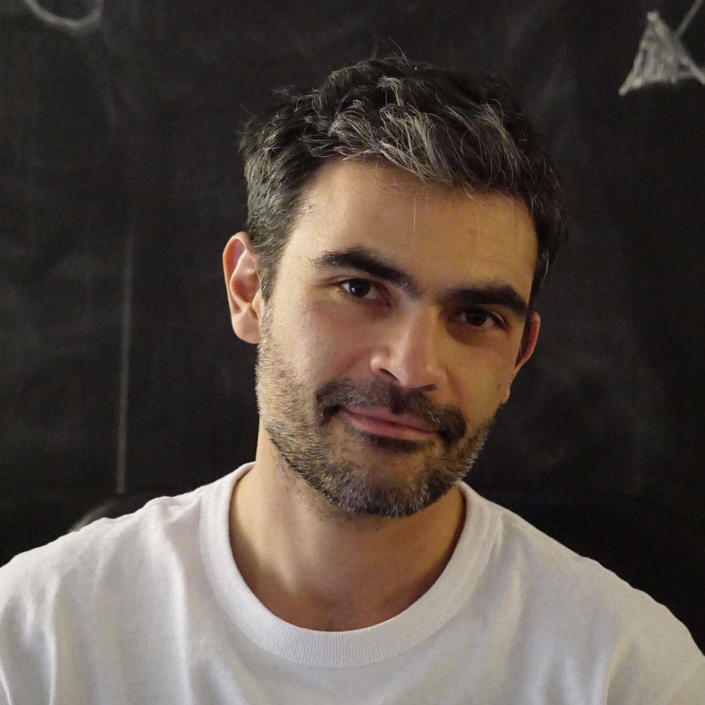

# Website Content Guide

This guide explains where to update text, images, logos, portfolio projects, and blog articles without changing the website layout or CSS classes.

## Safe editing workflow

1. Work inside `website_master`.
2. Update content in the files listed below.
3. Run `cmd /c npm run content:build` after changing blog Markdown.
4. Run `cmd /c npm run dev` and review the site locally.
5. Run `cmd /c npm run content:validate` before committing.
6. Run `cmd /c npm run build` before publishing.

When correcting grammar, edit only the words between HTML tags. Do not rename values such as `class`, `id`, `href`, `src`, `data-tags`, or `data-categories` unless the guide specifically asks you to.

## Landing page

The landing page is `index.html`.

| Content | What to search for | What you can change |
| --- | --- | --- |
| Browser/search description | `<meta name="description"` | Summary shown by search engines |
| Hero | `<section class="hero"` | Eyebrow, name, introduction, chips, metrics, portrait, caption |
| Experience strip | `<section class="trust-strip"` | Organization names and introductory label |
| Expertise | `<section class="capabilities"` | Section introduction, three expertise cards, tags |
| Career path | `<section class="career-path"` | Dates, role titles, descriptions, CTA labels |
| Journal preview | `<section class="blog-teaser"` | Three featured article links and summaries |
| Portfolio | `<section class="my-work"` | Section copy and project cards |
| Moon Rabbit bridge | `id="connect"` | Company introduction and company links |

### Updating the hero portrait

The current portrait is:

```html

```

Place the new image inside `img/`, update the `src`, and write a useful `alt` description. A portrait around 1200 × 1500 pixels in WebP or optimized JPEG works well.

## About page

Edit `about.html`.

- Update the short role description inside `section__subtitle--about`.
- Update the biography inside `about-me__body`.
- Replace `img/who_i_am.jpg` to change the About image.
- Keep the Moon Rabbit and portfolio CTA links at the end of the biography.

## Portfolio cards

Portfolio cards live inside the `project-grid` in `index.html`.

Each card contains:

```html
<article class="project-card"
    data-tags="footwear cae generative"
    data-categories="computational-design cae-simulation product-footwear">
    <a href="project-page.html" class="project-card__media">
        
    </a>
    <div class="project-card__body">
        <p class="project-card__eyebrow">Category</p>
        <h3>Project title</h3>
        <p>Short project summary.</p>
        <div class="project-card__tags"><span>#tag</span></div>
        <a class="project-card__link" href="project-page.html">Open project</a>
    </div>
</article>
```

Use one or more of these values in `data-categories`:

- `computational-design`
- `cae-simulation`
- `product-footwear`
- `xr-interaction`
- `research-rd`

`data-tags` controls the descriptive hashtags. `data-categories` controls the six portfolio filters.

## Project pages

Each case study has its own root HTML file, for example:

- `fea_climbing.html`
- `ABC_climbing.html`
- `puma_xetic.html`
- `MIT_Design_Lab.html`

Search for these blocks:

- `project-hero__eyebrow`: discipline or category.
- `project-hero__title`: project name.
- `project-hero__lead`: short case-study introduction.
- `project-meta__card`: role, tools, timeline, and deliverables.
- `project-section`: project narrative sections.
- `project-gallery`: still images or videos.

Store project-specific images inside the existing `img/ProjectN/` directory whenever possible. Update both `src` and `alt` when replacing an image.

## Logos and shared images

- `img/jmp_logo.png`: dark/header personal logo.
- `img/jmp_logo_w.png`: light/footer personal logo.
- `img/MR_logo_white.png`: Moon Rabbit logo used on dark backgrounds.
- `img/canal_logo.png`: browser favicon.
- `img/branding/`: recommended location for future logo variants.

Navigation and footer markup is repeated across pages. Ask Codex to make site-wide navigation or logo changes so every page stays synchronized.

## Blog authoring

Do not edit `data/posts.json` manually. It is generated from Markdown.

1. Copy `content/blog/_template.md` into a new folder:

```text
content/blog/my-new-article/index.md
```

2. Put article images here:

```text
img/blog/my-new-article/hero.webp
img/blog/my-new-article/process-01.webp
```

3. Complete the metadata at the top of `index.md`.
4. Write the article below the second `---` line using Markdown.
5. Set `status: published` when it is ready.
6. Run:

```powershell
cmd /c npm run content:build
cmd /c npm run dev
```

7. Open:

```text
http://localhost:5173/blog/index.html
```

Article URLs use the ID:

```text
/blog/article.html?id=my-new-article
```

## Markdown examples

```markdown
# Main article heading

## Section heading

Regular paragraph with **bold text** and [a link](https://example.com).


> A highlighted quotation or observation.

- First point
- Second point
```

For an image with a visible caption:

```html
<figure>
  
  <figcaption>Explain why this image matters.</figcaption>
</figure>
```

## Image recommendations

- Hero images: 1600 × 900 pixels, ideally below 350 KB.
- Inline images: 1200–1600 pixels wide, ideally below 300 KB.
- Logos: SVG when possible; otherwise transparent PNG or WebP.
- Use WebP for new raster images when practical.
- Use lowercase filenames with hyphens and no spaces.
- Never overwrite an image with an unrelated image while keeping inaccurate `alt` text.

## Grammar corrections

Use `docs/COPY_REVIEW_CHECKLIST.md` before publishing. For large copy changes, update one section at a time and inspect it in the browser before moving to the next section.

